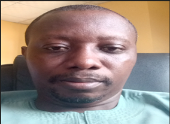
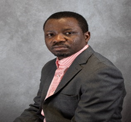
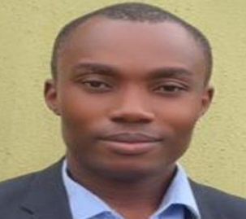
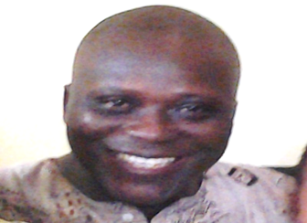

# Reviewers & Editorial Board Members

## List of Editorial Team Members

| S/No | Name                            | Affiliation                                                     | Area of specialization                | Email address                   |
| ---- | ------------------------------- | --------------------------------------------------------------- | ------------------------------------- | ------------------------------- |
| 1.   | Prof. Abdulwahab Giwa           | Federal University Dutsin-ma                                    | Chemical Engineering                  | agiwa@fudutsinma.edu.ng         |
| 2.   | Prof. Okewale Akindele          | Federal University of Petroleum Resources, Effurun, Delta State | Petroleum/Chemical Engineering        | okewale.akindele@fupre.edu.ng   |
| 3.   | Dr Adaobi Stephenie Nwosi-Anele | Rivers State University of Science and Technology               | Petroleum Economics                   | adaobi.nwosi-anele@ust.edu.ng   |
| 4.   | Engr Bright Bariakpoa Kinate    | Rivers State University                                         | Petroleum and natural gas Production  | kinate.bright@ust.edu.ng        |
| 5.   | Engr. Isaac Ihua- Maduenyi      | Rivers State University                                         | Reservoir Engineering                 | isaac.ihua-maduenyi@ust.edu.ng  |
| 6.   | Dr. Abdullahi Adamu             | Newcastle University                                            | Chemical Engineering                  | abdullahi.adamu@newcastle.ac.uk |
| 7.   | Prof. Folade Gbenga             | University of Ibadan, Oyo State                                 | Petroleum Energy economics and law    | falodelias@gmail.com            |
| 8.   | Professor Samuel T. Wara        | Edwin Clark University, Kiagbodo                                | Energy management                     | docwarati@gmail.com             |
| 9.   | Prof. Adenike Ogunshe           | University of Ibadan                                            | Biotechnology/Microbiology            | adenikemicro@gmail.com          |
| 10.  | Prof. Oludele Awodele           | Babcok University                                               | Artificial Intelligence and computing | awodeleo@babcock.edu.ng         |
| 11.  | Dr. Morgan Akpan                | African University of Science and Technology                    | Geology                               | leo@aust.edu.ng                 |
| 12.  | Dr. Jasper Ahamefula Agbakwuru  | Federal University of Petroleum Resources, Effurun, Delta State | Offshore and Underwater Engineering   | agbakwuru.jasper@fupre.edu.ng   |
| 13.  | Opeyemi Oni                     | University of North Dakota.                                     | Energy and Petroleum Engineering      | opeyemi.oni@und.edu             |
| 14.  | Prof Thaddeus Chidiebere Nwaoha | Federal University of Petroleum Resources, Effurun, Delta State | Offshore and Underwater Engineering   | nwaoha.thaddeus@fupre.edu.ng    |
| 15.  | Dr Ali Aliyu                    | University of Lincoln                                           | Sustainable Energy                    | AAliyu@lincoln.ac.uk            |

## Profile of Editorial Board Members

### Dr. Abdullahi Adamu

Engr. Abdullahi is a Research Associate in the School of Engineering at Newcastle University with over four years of research experience in Chemical Engineering. He holds a B.Sc. and M.Sc. in Chemical Engineering from Mendeleev University of Chemical Technology of Russia, and a Ph.D. in Chemical Engineering from Newcastle University. His research focuses on process intensification, with expertise in catalysis, reaction engineering, and process engineering. He has contributed to the development of sustainable technologies for carbon capture and conversion, biorefining, gas sweetening, and wastewater treatment. Abdullahi is a COREN-certified engineer, a Corporate Member of the Nigerian Society of Engineers (NSE), and an Associate Member of the Institution of Chemical Engineers (IChemE), where he also serves on the Catalysis and Reaction Engineering Special Interest Group.

### Prof. Akindele Oyetunde Okewale

Prof. Akindele Oyetunde Okewale is a Professor in the Department of Chemical Engineering at the Federal University of Petroleum Resources, Effurun, Delta State. His work focuses on corrosion studies, separation processes, and renewable energy, with expertise in converting waste biomass into value-added products such as biofuels, bioethanol, and corrosion inhibitors. He is a registered engineer certified by COREN in Nigeria.

### Engr. Isaac Eze Ihua-Maduenyi

Engr. Isaac Eze Ihua-Maduenyi is a Lecturer in the Department of Petroleum Engineering at Rivers State University, Nigeria. He has over three years of academic experience complemented by professional exposure in reputable oil and gas companies. He holds an M.Eng. in Petroleum Engineering from the Federal University of Technology, Owerri; a PGD in Petroleum Engineering from the Institute of Petroleum Studies, UniPort/IFP France; and a B.Eng. in Petroleum Engineering from the Federal University of Technology, Owerri. His research interests include Petroleum Production Engineering and Production Optimization, and he has co-authored several publications in reputable journals.

### Prof. Samuel T. Wara

Prof. Samuel T. Wara, PhD, FIMC, CMC, FNSE, FIET, R.Eng (COREN) is a Professor of Energy and Power Systems and an Energy Management Consultant. He has held key academic and leadership positions, including Vice-Chancellor of Havilla University, Dean of Postgraduate Studies, Director of Research, Innovation & Discovery, and Founding Dean of the College of Engineering at Igbinedion University. His expertise covers renewable energy, power systems, and energy management, and he has contributed extensively to research, innovation, and professional practice. Prof. Wara is a fellow of several professional bodies, including the Nigerian Society of Engineers (NSE) and the Institution of Engineering and Technology (IET).

### Dr. Opeyemi Oni

Dr. Opeyemi Oni is a petroleum engineer and researcher with over 15 years of experience in teaching, laboratory practice, and applied research across oil, gas, and geothermal systems. His expertise spans drilling fluid design and optimization, drilling engineering, production technology, and geothermal heat extraction. He has contributed to academic and laboratory development through the design of instructional manuals, crude oil characterization, and petrophysical analysis, while supervising undergraduate and postgraduate research. Currently at the University of North Dakota, his work focuses on developing novel and waste-derived materials to improve drilling fluid performance using advanced analytical techniques, with findings disseminated through conferences and peer-reviewed publications.

### Engr. Bright Bariakpoa Kinate

Engr. Bright Bariakpoa Kinate is a lecturer in the Department of Petroleum Engineering at Rivers State University, Nigeria, with over eight years of teaching and research experience in petroleum and gas engineering. His academic and research contributions span flow assurance, CO₂ sequestration, produced water treatment, alkaline–surfactant–polymer flooding, corrosion inhibition, and crude oil emulsion treatment. He has authored and co-authored over 35 articles in international peer-reviewed journals and presented more than seven technical papers at the SPE Nigeria Annual International Conference and Exhibition. His research interests focus on petroleum production optimization, flow assurance, carbon capture, utilization and storage (CCUS), and well completion operations.

### Prof. Oludele Awodele

AWODELE Oludele is a Professor of Computer Science and Artificial Intelligence in the School of Computing, Babcock University, Ilisan-Remo. He was Head of the Department of Computer Science (2009-2016), Dean, School of Computing and Engineering Sciences (2016-2020), and currently the Director of Academic Planning, Babcock University, Nigeria. His current research is on Artificial Intelligence, Blockchain Technology, Data Communications and Computer Security. He has successfully supervised 18 PhDs and currently mentoring 5 PhD Scholars in different areas of Artificial Intelligence, Computer Science and Block chain Technology. Prof Awodele has contributed significantly to the growth and development of his professional association. He is a Fellow, Nigeria Computer Society (NCS), and Member of the following professional bodies: Computer Professional Registration Council of Nigeria (CPN), Institute of Cooperate Administration (ICA), USA Informing Science Institute (ISI), CPN Education and Man power Development Committee, NCS Publication and Research Committee, Babcock University Ethics Committee, Ethical Review Committee of Nigeria Computer Society (2013-2015). He has published well over 150 papers both in International and Local Journals and attended several academic conferences across the globe. He was the Editor-in-Chief of the following Nigeria Computer Society Journals: International Journal of Information Security Privacy & Digital Forensics and the Journal of Computer Science and Its Applications (2017-2021). Senior Member of the Institute of Electrical and Electronics Engineers, Member of Editorial Review Board InSITE USA, Member Governing Council, Association of Applied Information, Management Professionals, Member, National Executive Committee of the Nigeria Computer Society (2017- 2025), Member Governing Council of the Computer Professional Registration Council of Nigeria (2019- 2025) and the Chairman, Innovation, Research and Development Committee of the Nigeria Computer Society (2017 -2021). He made a distinction is a training course on Theory, Practice and future development in Accreditation in Higher Education organized by the National Universities Commission (NUC), National Open University of Nigeria (NOUN) and African Quality Assurance Network (AfriQAN) in 2021. He also made a distinction in another training course on Theory, Practice and Future of Academic Planning in University Education organized by NUC and NOUN in 2022. The indefatigable scholar has served as external examiner and assessor to many Universities within and outside the Country. In recognition of his hard work, diligence, and immeasurable contribution to the body of knowledge and societal development, he has been conferred with numerous distinguished awards. He is happily married and blessed with lovely children.

## Journal Advisory Board Members

| S/N | NAME                                      | AFFILIATION                                                     | AREA OF SPECIALIZATION                                                                     | EMAIL                          |
| --- | ----------------------------------------- | --------------------------------------------------------------- | ------------------------------------------------------------------------------------------ | ------------------------------ |
| 1.  | Dr David Hitchmough PhD MEng AMRINA AFHEA |                                                                 | Research Fellow in Maritime Decarbonization, School of Engineering, Mechanical Engineering | D.M.Hitchmough@ljmu.ac.uk      |
| 2.  | Prof. Ayansi Francis Ifeanyi              | Ambros Alli University, Ekpoma, Edo State                       | Electrical and Electronics Engineering                                                     | francisanyasi@aauekpoma.edu.ng |
| 3.  | Dr Michael A. Adegbite                    | Petroleum Training Institute (Retiree)                          | Welding Corrosion Engineering                                                              | adegbite_ma@pti.edu.ng         |
| 4.  | Dr. Kevin Idehen                          | Petroleum Training Institute                                    | Chemistry/Polymer Chemistry                                                                | kiidehen@yahoo.com             |
| 5.  | Prof Benjamin Ugbeoke Iyenagbe            | University of Abuja/Edo State University                        | Materials Engineering and Applied Solid Mechanics                                          | ben.ugheoke@uniabuja.edu.ng    |
| 6.  | Prof Thaddeus Chidiebere Nwaoha           | Federal University of Petroleum Resources, Effurun, Delta State | Offshore, Marine and Underwater Engineering                                                | nwaoha.thaddeus@fupre.edu.ng   |
| 7.  | Dr Jasper Agbakwuru                       | Federal University of Petroleum Resources, Effurun              | Offshore/Subsea Engineering                                                                | agbakwuru.jasper@fupre.edu.ng  |
| 8.  | Prof Ibrahim Ali Mohammed-Dabo            | Amadu Bello University, Zaria                                   | Chemical Engineering                                                                       | iamohammed-dabo@abu.edu.ng     |

### Prof. Thaddeus Chidiebere Nwaoha

Prof. Thaddeus Chidiebere Nwaoha is a Professor of Marine and Offshore Engineering System Reliability in the Marine Engineering Department, College of Engineering and Technology, at Federal University of Petroleum Resources. He holds a Ph.D. in Marine and Offshore Engineering from Liverpool John Moores University, in addition to MSc and B.Eng. degrees obtained in the United Kingdom and Nigeria, respectively. His research interests include marine and offshore engineering systems reliability, offshore system design, failure analysis, safety engineering, and uncertainty modeling using artificial intelligence. Professor Nwaoha has extensive teaching and research experience, with over 80 journal publications, 8 conference papers, and 3 patents to his credit. He has supervised numerous B.Eng., M.Eng., and Ph.D. research projects as both principal and co-supervisor. He also serves on the editorial boards of several reputable journals and is a professional member of the Council for the Regulation of Engineering in Nigeria, the Nigerian Society of Engineers, the Institute of Marine Engineering, Science and Technology, and the Nigerian Institute of Marine Engineers and Naval Architects.

### Dr. Jasper Ahamefula Agbakwuru

Dr. Jasper Ahamefula Agbakwuru is a Professor of Offshore Engineering and Underwater Technology in the Marine Engineering Department at the Federal University of Petroleum Resources. He is an experienced academic and engineering professional with expertise in offshore engineering, subsea systems, underwater technology, sustainable energy, and ocean engineering. With over 15 years of industry experience and more than a decade in academia, he focuses his research on blue economy technologies, ocean renewable energy, climate change engineering, AI applications in offshore systems, and oceanography. Professor Agbakwuru holds a Ph.D. in Offshore Engineering, an M.Sc. in Subsea Engineering, a B.Eng. in Mechanical Engineering, and a Diploma in Electrical/Electronic Engineering. He is also an IMCA-certified underwater diver and a member of the Council for the Regulation of Engineering in Nigeria, Nigerian Society of Engineers, and Society for Underwater Technology. He has secured national and international research grants, holds several patents, and has authored over sixty scholarly publications. His work continues to advance innovation and sustainable solutions in offshore and underwater engineering.

### Prof. Francis Anyasi

<!--  -->

Prof. Francis Anyasi, PhD, M.Eng, B.Eng, FNSE, R.Eng (COREN) is a Professor of Telecommunication Engineering at Ambrose Alli University, Ekpoma, Edo State, Nigeria. He has extensive academic and professional experience in telecommunications engineering and has contributed to advancing research and practice in the field. Prof. Anyasi is a COREN-registered engineer and a Fellow of the Nigerian Society of Engineers (NSE).

## Thematic Areas for the Journal

1. Exploration, Production, and Operations (Upstream, Midstream, Downstream)
2. Health, Safety, and Environment (HSE) Management
3. Renewable Energy Integration Technologies
4. Transportation, Logistics, and Gas Flare Commercialization
5. Innovations in R&D, Digital Tech, and AI/Robotics
6. Asset Protection, SCADA, IoT, and Remote Monitoring
7. Energy Trading, Risk Management, and Financing
8. Sustainability, Environmental Management, and CCUS
9. Geology, Geophysics, and Mineral Exploration
10. Offshore, Marine, and Subsea Technology
11. Human Capital and Workforce Development
12. Regulatory, Legal, and Policy Frameworks
13. Market Trends and Strategic Outlook
14. Unconventional Resources and Energy Security
15. Collaboration and industry partnerships
16. Process Systems, Hydrocarbon Accounting and

## From the Chief Editor’s Desk

Journal of Hydrocarbon Science and Technology (JHST)
Petroleum Training Institute, Effurun, Nigeria

In an era where the global energy landscape is undergoing unprecedented transformation, the Journal of Hydrocarbon Science and Technology (JHST) emerges as a timely response to a critical need — the need to rethink, redefine, and renew our approach to energy development, sustainability, and innovation.
The Petroleum Training Institute (PTI), for over five decades, has served as Nigeria’s premier institution for technical excellence in the petroleum and allied sectors. Through education, applied research, and industry collaboration, PTI has equipped generations of professionals with the competence and creativity to advance the oil and gas industry. The JHST is a natural evolution of this legacy — a bridge between research and real-world application, between academia and industry, between innovation and impact.
Our mission at JHST is to provide a global platform for original, peer-reviewed research that deepens understanding and drives innovation across the hydrocarbon value chain — from exploration and production to refining, environmental management, renewable integration, and digital transformation. We welcome contributions that address both the opportunities and the challenges of the energy transition — where hydrocarbons, renewables, and new technologies converge to shape a sustainable future.
In line with PTI’s commitment to excellence, JHST upholds rigorous standards of scholarly integrity, transparency, and quality. Our distinguished editorial and review boards bring together leading experts, scientists, and professionals from around the world — ensuring that each publication meets the highest levels of technical and ethical credibility.
We envision this Journal not merely as a collection of articles, but as a platform for dialogue, a catalyst for innovation, and a repository of insight — where ideas transform into technologies, and research drives resilience in an evolving energy economy.
As we embark on this exciting journey, I invite researchers, industry professionals, policymakers, and students alike to contribute, collaborate, and engage with JHST. Together, we can advance the science and technology that sustain our energy future — responsibly, intelligently, and inclusively.
Welcome to the Journal of Hydrocarbon Science and Technology — where energy meets innovation.

Dr. Fredrick B. Owoyemi
Chief Editor
Journal of Hydrocarbon Science and Technology (JHST)
Petroleum Training Institute, Effurun, Nigeria
